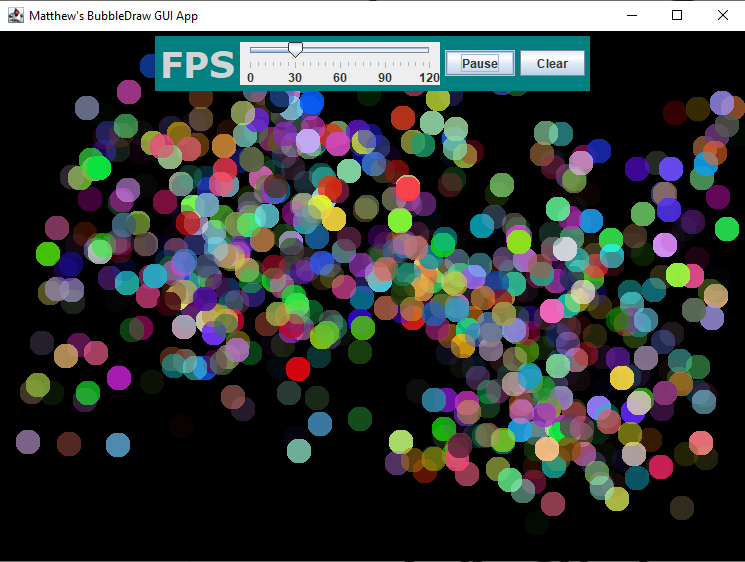
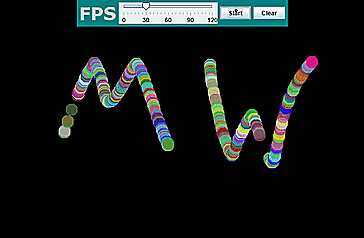
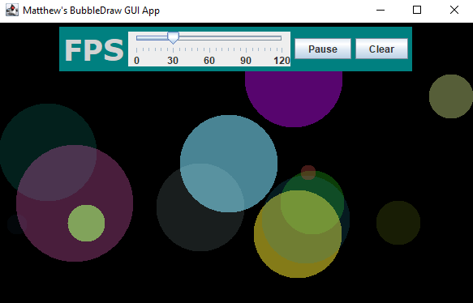

# BubbleDrawGUI

A Java program that allows users to draw bubbles that will bounce around the window. Bubbles are drawn either by clicking or clicking and dragging the left mouse button. Users may control the FPS to make the bubbles move more quickly or slowly. Also, it's possible to pause or clear the bubbles. Lastly, the mouse wheel can make the bubbles smaller or larger.

## FPS slider

## Varying sizes

